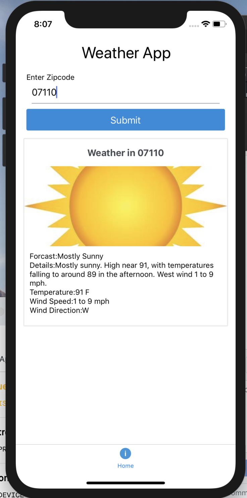

# React-Natice-Weather-App

Frontend built in React Native, backend in NodeJS, using weather api

<a href="https://www.linkedin.com/in/eric-palumbo-8a7a4964/">Built by Eric Palumbo</a>
 
 

<h1>Intro</h1>

 Weather app 

Enter your zipcode and the most recent weather for the current time will be grabbed from the weather.gov api which weather.org uses as well

<h2>How it works</h2>

Enter your zipcode

React Native makes a request to the backend server passing the zipcode to it

Using the npm zipcodes, it grabs the latitude and Longitude and passes it to the weather.gov api

<h1>Setup</h1>
<ul>
    <li>run npm install on the react native folder and on the backend folder</li>
    <li>Open a terminal and go into the react native folder and run npm start</li>
    <li>Open another terminal and go into the backend code and run node server.js</li>
<ul>

